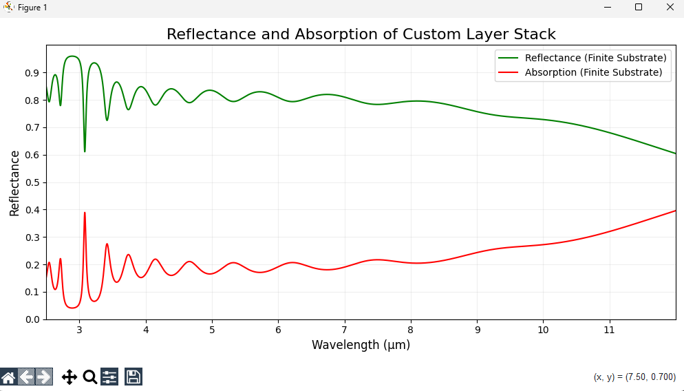
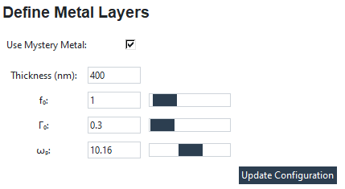
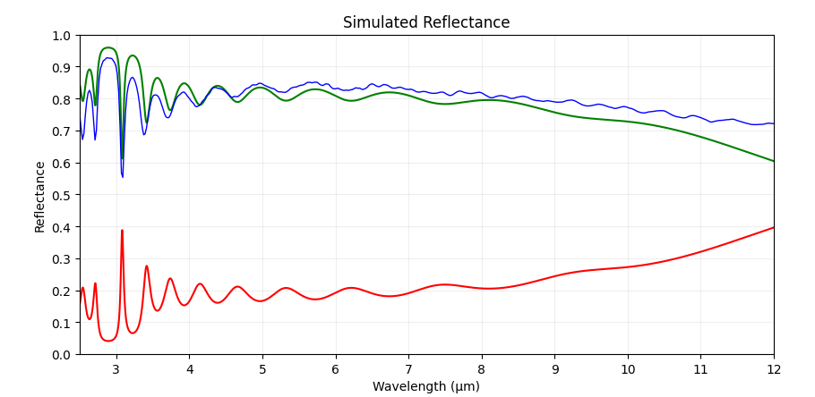

# Optical Simulation and Fitting Tool

Simulate reflectance and absorption spectra for layered materials, compare them with experimental plots, and refine the fit using adjustable parameters.

---

  

---

## Features

- **Simulate Reflectance and Absorption**: Generate spectra based on input parameters for layered materials.
- **Manual Drude Parameter Input**: Customize unknown metals using manually entered Drude parameters (`f0`, `γ0`, `ωp`) or by adding each layer separately.
- **Graph Fitting**: Optimize the simulated plots to match your experimental data using intuitive parameter adjustments.
- **Dynamic Material Adjustments**: Fine-tune optical properties like refractive index, absorption coefficient, and more.

---

## Finite Substrate Modeling

In traditional simulations, substrates are often considered semi-infinite, assuming that the material extends infinitely without accounting for thickness variations. This simplification can lead to inaccuracies, especially for materials like Gallium Antimonide (GaSb) and Gallium Arsenide (GaAs), where substrate thickness significantly influences optical properties.

Our tool incorporates finite substrate modeling, utilizing empirical data from GaSb and GaAs to enhance simulation accuracy. By accounting for the actual thickness of these substrates, the tool provides a more precise representation of reflectance and absorption spectra.

  

*Source: [High power cascaded mid-infrared InAs/GaSb light emitting diodes](https://pubs.aip.org/aip/jap/article/118/12/123108/141975)*

---

## Unknown Metal

  

For cases where the material is not predefined, you can manually input Drude parameters:

- **`f0`**: Oscillator strength
- **`γ0`**: Damping factor
- **`ωp`**: Plasma frequency

These parameters allow for custom fitting of the unknown material's reflectance and absorption properties.

---

## Parameter Adjustments

Fine-tune your simulation to match experimental results with the following adjustable parameters:

| Parameter | Effect on Reflectance/Absorption |
|-----------|----------------------------------|
| **Δn**    | Changes refractive index, shifting reflectance. |
| **Δα**    | Adjusts absorption, darkening the spectrum. |
| **Δωp**   | Alters plasma frequency, shifting peaks. |
| **Δf**    | Modifies oscillator strength, intensifying peaks. |
| **ΔΓ**    | Controls damping, affecting peak sharpness. |
| **Δω**    | Influences resonance width, broadening or narrowing peaks. |

---

## How to Use

1. **Input Parameters**:
   - Enter material properties, layer thicknesses, and Drude parameters (if applicable).
   - For unknown metals, manually input `f0`, `γ0`, and `ωp`.

2. **Run Simulation**:
   - Generate reflectance and absorption spectra using the provided inputs.

3. **Adjust Parameters**:
   - Compare the simulated graph with your experimental data.
   - Modify parameters such as Δn, Δα, and Δωp to refine the fit.
   

  

4. **Optimize Fit**:
   - Repeat the process until the simulated spectra align with your experimental results.

---

This tool is designed to streamline the process of optical simulation and experimental data fitting, making it an essential resource for researchers in material science and optics.

*Note: Further optimizations are continually being implemented to enhance usability and ease of fitting.*
