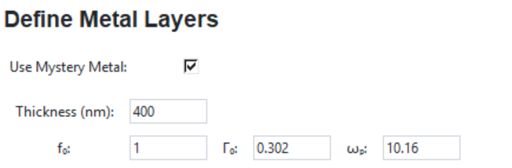

# Optical Simulation and Fitting Tool

Simulate reflectance and absorption spectra for layered materials, compare them with experimental plots, and refine the fit using adjustable parameters.

---

  

---

## Features

- **Simulate Reflectance and Absorption**: Generate spectra based on input parameters for layered materials.
- **Manual Drude Parameter Input**: Customize unknown metals using manually entered Drude parameters (`f0`, `γ0`, `ωp`) or adding each layer separately.
- **Graph Fitting**: Optimize the simulated plots to match your experimental data using intuitive parameter adjustments.
- **Dynamic Material Adjustments**: Fine-tune optical properties like refractive index, absorption coefficient, and more.

---

## New Feature: Unknown Metal

For cases where the material is not predefined, you can manually input Drude parameters:

- **`f0`**: Oscillator strength  
- **`γ0`**: Damping factor  
- **`ωp`**: Plasma frequency  

These parameters allow for custom fitting of the unknown material's reflectance and absorption properties.

  

---

## Parameter Adjustments

Fine-tune your simulation to match experimental results with the following adjustable parameters:

| Parameter  | Effect on Reflectance/Absorption |
|------------|----------------------------------|
| **Δn**     | Changes refractive index, shifting reflectance. |
| **Δα**     | Adjusts absorption, darkening the spectrum. |
| **Δωp**    | Alters plasma frequency, shifting peaks. |
| **Δf**     | Modifies oscillator strength, intensifying peaks. |
| **ΔΓ**     | Controls damping, affecting peak sharpness. |
| **Δω**     | Influences resonance width, broadening or narrowing peaks. |

---

## How to Use

1. **Input Parameters**:
   - Enter material properties, layer thicknesses, and Drude parameters (if applicable).
   - For unknown metals, manually input `f0`, `γ0`, and `ωp`.

2. **Run Simulation**:
   - Generate reflectance and absorption spectra using the provided inputs.

3. **Adjust Parameters**:
   - Compare the simulated graph with your experimental data.
   - Modify parameters such as Δn, Δα, and Δωp to refine the fit.

4. **Optimize Fit**:
   - Repeat the process until the simulated spectra align with your experimental results.

---

This tool is designed to streamline the process of optical simulation and experimental data fitting, making it an essential resource for researchers in material science and optics.
