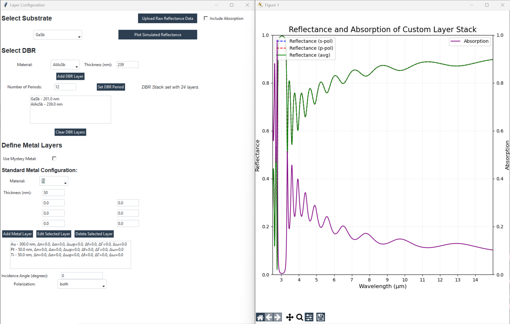

# OptiFit [![Cult Of Martians][cult-img]][cult] 

Simulate reflectance and absorption from given inputs and fit the graph to your experimental plot.

  

## Features

- Simulate reflectance and absorption spectra for multilayer structures.
- Fit simulated results to experimental data to optimize material and structural parameters.

## Parameter Adjustments

When fitting your experimental data to the simulated reflectance and absorption spectra, you can adjust the following parameters to refine your model:

- **Δn (Change in refractive index)**: 
  - Adjusting this parameter will change the optical properties of the material. Increasing Δn generally increases the reflectance at specific wavelengths, while decreasing it can reduce reflectance. This affects how "sharp" or "damped" the reflectance curve appears.
  
- **Δα (Change in absorption coefficient)**:
  - Increasing Δα will increase the absorption at specific wavelengths, leading to a decrease in reflectance and an increase in absorption. A higher Δα results in a "darker" spectrum where more light is absorbed by the material, reducing the reflectance.

- **Δωp (Change in plasma frequency)**:
  - Modifying Δωp alters the material's behavior at higher frequencies. A shift in plasma frequency can cause a "stretching" or "compression" of the reflectance spectrum along the wavelength axis. Increasing Δωp generally shifts the reflectance curve to higher wavelengths, while decreasing it shifts the curve to lower wavelengths.

- **Δf (Change in oscillator strength)**:
  - The oscillator strength affects how strongly the material interacts with light at specific resonant frequencies. A larger Δf increases the peak reflectance at resonant wavelengths, making the material more reflective at those wavelengths, while smaller Δf values reduce the intensity of the peaks.

- **ΔΓ (Change in damping factor)**:
  - The damping factor controls how quickly the material's response to light decays. Increasing ΔΓ leads to broader, flatter peaks in the reflectance curve, as the material absorbs light over a wider range of wavelengths. Decreasing ΔΓ results in sharper, more pronounced peaks.

- **Δω (Change in the width of resonance)**:
  - A change in Δω influences the spectral width of the reflectance peaks. Increasing Δω broadens the resonance, flattening the peak, while decreasing Δω narrows the resonance, making the reflectance peak more pronounced and sharper.

By adjusting these parameters, you can "squeeze" or "stretch" the reflectance spectrum, shifting it along the wavelength axis or modifying its sharpness and intensity. This allows for the optimization of the model to match the experimental data accurately.

## How to Use

1. Input your material and layer parameters (e.g., refractive indices, absorption coefficients, layer thicknesses) into the simulation.
2. Run the simulation to generate the reflectance and absorption spectra.
3. Compare the simulated data to your experimental plot and adjust the Δ parameters to fit the curves.
4. Repeat the fitting process until the simulated data matches your experimental results.
