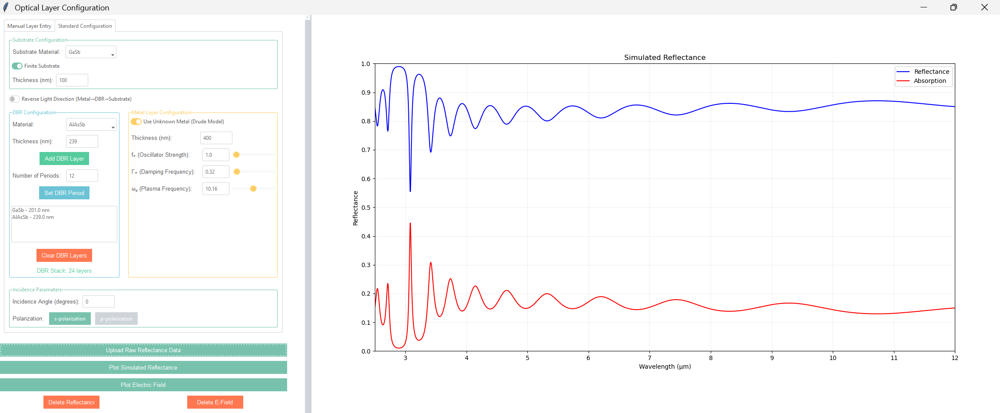

# Optical Absorption Simulation 

## Features
- Dual simulation modes for different experimental needs
- Comprehensive material library(more to be added) with composition control
- Advanced Drude model parameter adjustment
- Experimental data import and comparison tools

## Operation Modes

### 1. Standard Configuration
**Structure**:
1. Metal Contact (adjustable Drude parameters)
2. DBR Stack (alternating layers)
3. Active Layer
4. Substrate

**Drude Parameters**:
'f0' = Oscillator strength
'γ0' = Damping coefficient [eV]
'ωp' = Plasma frequency [eV]

## 2. Manual Configuration

### Customization Options:
- Layer-by-layer structure design
- Material selection from library
- Composition adjustment for alloys
- Thickness control for each layer

### Example Workflow:
1. Add substrate layer (e.g., GaAs)
2. Add active layers (e.g., AlGaAs QWs)
3. Add top contacts (e.g., Au/Ti)
4. Set measurement parameters

## Material Support

### Semiconductor Alloys

| Material       | Composition Range | Bandgap Range (eV) | Refractive Index @ 1.5µm |
|----------------|-------------------|--------------------|--------------------------|
| AlₓGa₁₋ₓAs     | x = 0-1.0         | 1.42-2.16          | 3.3-2.9                  |
| AlₓAs₁₋ₓSb     | x = 0-1.0         | 0.73-1.62          | 3.8-3.1                  |
| AlₓGa₁₋ₓSb     | x = 0-1.0         | 0.73-1.60          | 3.8-3.2                  |

## Experimental Data Comparison

### Supported Formats:
- CSV (wavelength, absorption)